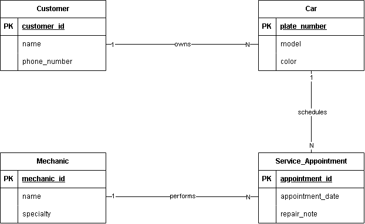

# INFOMAN1 - Week 2 Lab: Conceptual ERD Case Study
**Name:** Kaizer David R. Palabay  
**Student ID:** 2510997  
**Section:** BSIT-II  

## Task 1 — Candidate Entities

| Entity | Justification |
|---|---|
| Customer | The scenario explicitly mentions the shop has "many customers" who bring in cars, making Customer an independent person/actor entity in the system. |
| Car | The text states "each car has a model, a plate number, and a color," qualifying Car as a physical object entity rather than a simple descriptor. |
| Mechanic | The shop "employs several mechanics, each with a name and a specialty," qualifying Mechanic as an organizational employee entity. |
| Service-Appointment | Work occurs during a "scheduled service appointment" with "a date and a short repair note," qualifying it as an event transaction entity. |

## Task 2 — Attributes per Entity

### Customer
- Primary Key: `customer-id`
- Attributes:
  - `customer-id` — Domain: numeric integer (auto-generated)
  - `name` — Domain: variable-length text (varchar)
  - `phone-number` — Domain: text string

### Car
- Primary Key: `plate-number`
- Attributes:
  - `plate-number` — Domain: alphanumeric string (e.g., 'ABC-1234')
  - `model` — Domain: text (e.g., 'Sedan', 'Civic')
  - `color` — Domain: text

### Mechanic
- Primary Key: `mechanic-id`
- Attributes:
  - `mechanic-id` — Domain: numeric integer
  - `name` — Domain: text
  - `specialty` — Domain: text (e.g., 'engine', 'brakes', 'electrical')

### Service-Appointment
- Primary Key: `appointment-id`
- Attributes:
  - `appointment-id` — Domain: numeric integer
  - `appointment-date` — Domain: date (YYYY-MM-DD)
  - `repair-note` — Domain: long text string

## Task 3 — Relationships

| Relationship (verb phrase) | Between | Cardinality | Checked both directions? |
|---|---|---|---|
| owns | Customer ↔ Car | 1:N | Yes — One customer may bring in one or more cars, but each car belongs to exactly one customer. |
| schedules | Car ↔ Service-Appointment | 1:N | Yes — One car can have multiple service appointments over time, but each appointment is scheduled for exactly one car. |
| performs | Mechanic ↔ Service-Appointment | 1:N | Yes — One mechanic may work on many service appointments over time, but each specific service appointment is assigned to one mechanic. |

## Task 4 — Conceptual ERD

